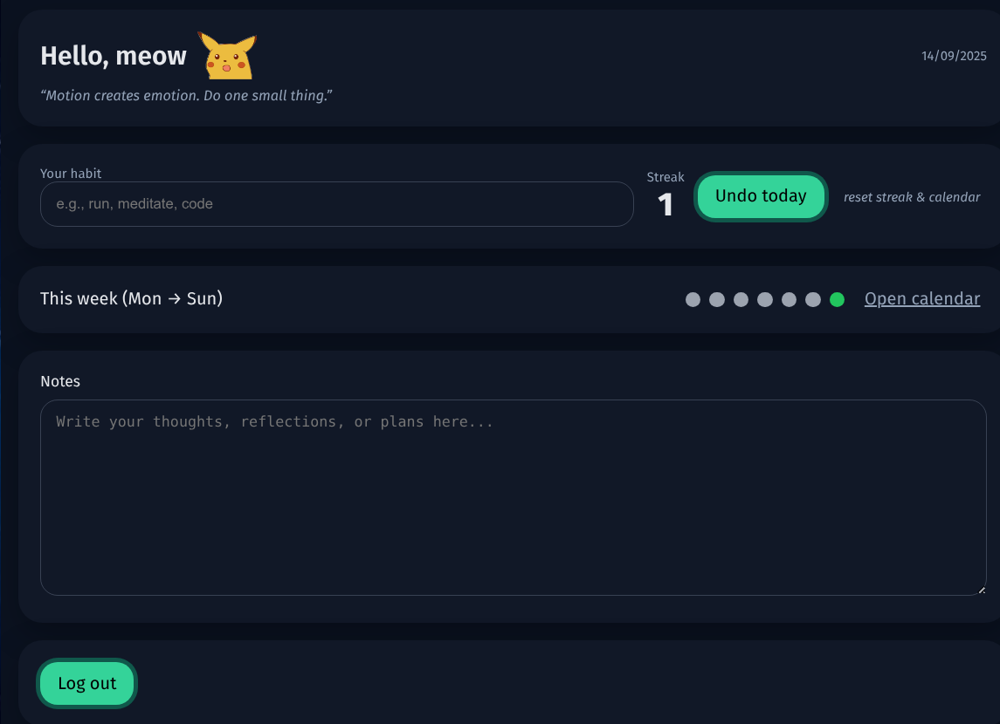
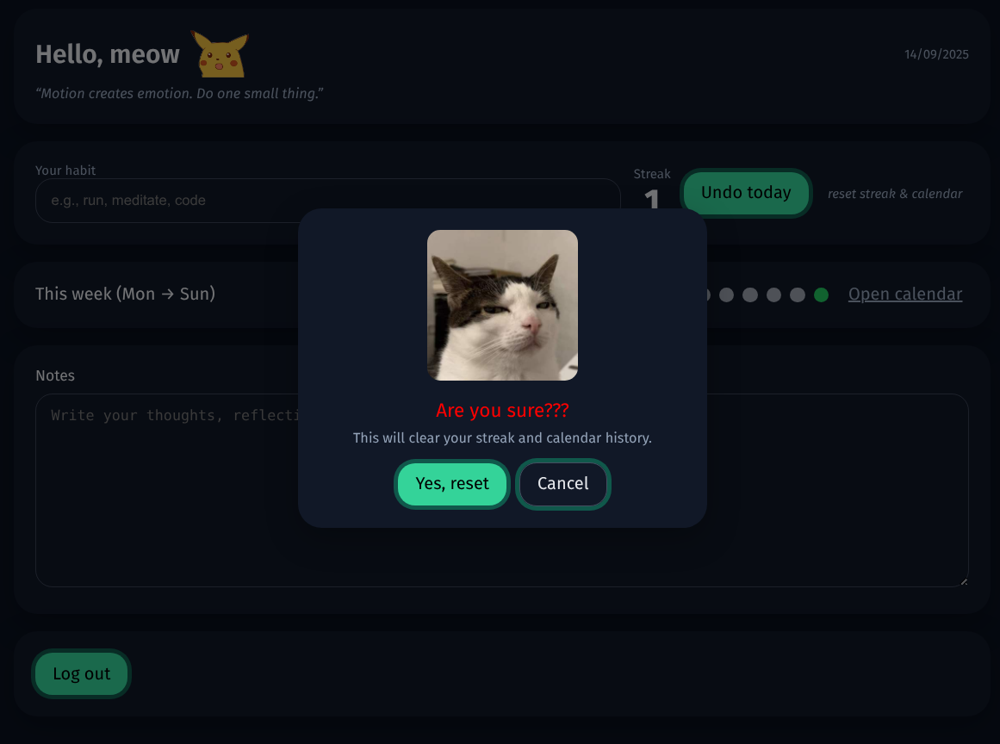

# 🌱 OneHabit

<p align="center">
  
</p>

<p align="center">
  <b>Minimal. Focused. Just one habit at a time.</b><br/>
  A lightweight habit tracker built with Next.js + Supabase.<br/>
  Live demo → <a href="https://one-habit.vercel.app/">one-habit.vercel.app</a>
</p>

---

## ✨ Features

- 🔑 **Username + Password Auth** (Supabase powered)  
  – no emails, just `username` + `password`  
- 🔥 **Streaks** — mark your habit each day and keep your streak alive  
- 📅 **Calendar + Week Dots** — Mon→Sun overview and monthly progress  
- 📝 **Notes** — jot down reflections and reminders  
- 🎨 **Aesthetic UI** — loader screen, Pikachu hover, subtle zoom animations  
- 📱 **Responsive** — works on desktop and mobile  
- 🚀 **Deploy-ready** — optimized for Vercel

---

## ❓ Why *One Habit*?

Most habit trackers overload you with options, data, and multiple goals.  
But when you try to juggle too many improvements at once, you become **overwhelmed** and burn out.  

**OneHabit** is designed with a crystal-clear philosophy:

- Focus on **just one goal** at a time 🌱  
- Keep the UI **minimalistic**, distraction-free  
- Build consistency day by day, without decision fatigue  
- Let streaks and small wins compound into meaningful change  

It’s not about doing everything. It’s about doing **one thing well.**

---

## 🖼️ Screenshots

### Preview Icons
| Loader | Tracker | Calendar |
|--------|---------|----------|
|  |  |  |

### Live Website
<p align="center">
  <br/>
  <em>Homepage / Habit Tracker</em>
</p>

<p align="center">
  <br/>
  <em>RESET?? :/</em>
</p>

---

## ⚡ Quickstart

```bash
git clone <your-public-repo-url> onehabit
cd onehabit
cp .env.example .env.local
npm install
npm run dev
